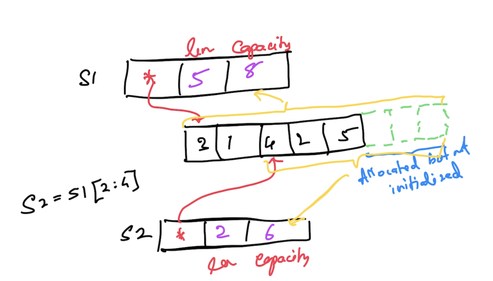
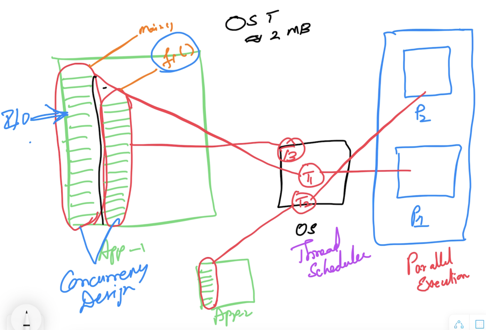
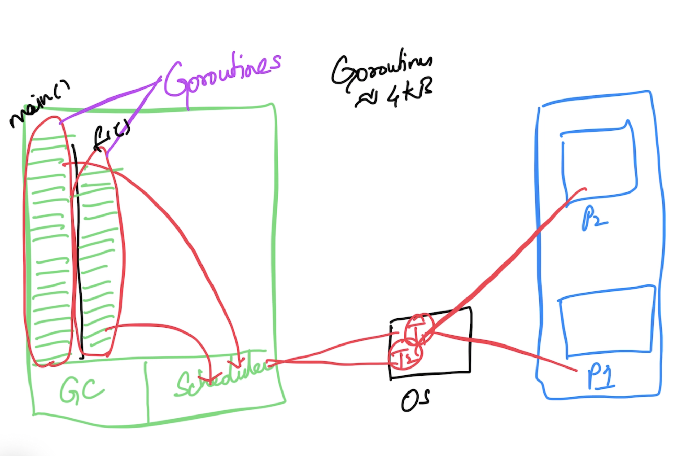
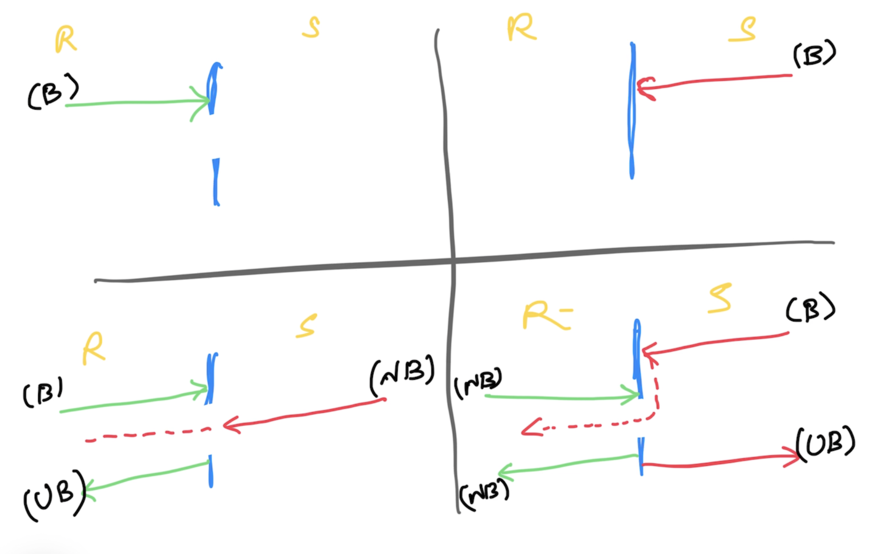

# Go Foundation

## Magesh Kuppan
- tkmagesh77@gmail.com

## Exercism
- https://exercism.org/docs/using/solving-exercises/working-locally

## Schedule
| what | when |
|-----|-------
| Commence      | 09:30 AM  |
| Tea Break     | 11:00 AM (20 mins) |
| Lunch Break   | 01:00 PM (1 hr) |
| Tea Break     | 03:30 PM (20 mins) |
| Wind up       | 05:30 PM |

## Software Requirements
- Go Tools (https://go.dev/dl)
- Visual Studio Code (https://code.visualstudio.com)
- Docker Desktop

## Repository
- https://github.com/tkmagesh/thoughtclan-go-aug-2024

## Methodology
- No powerpoint
- Discussion & Code

## Books
- [Growing Object Oriented Software Guided By Tests](https://www.amazon.in/Growing-Object-Oriented-Software-Guided-Tests/dp/8131734730)
- [Agile Principle Patterns & Practices](https://www.amazon.in/Agile-Principles-Patterns-Practices-PRACTS-ebook/dp/B0051TM4GI)

## 
- Language Foundation
- Concurrency Programming
- Http Services

## Why Go?
- Simplicity
    - ONLY 25 keywords
    - No access modifiers (public/private/protected)
    - No Classes (ONLY structs)
    - No Inheritance (ONLY composition)
    - No reference types (Everything is a value)
    - No pointer arithmatic
    - No exceptions (ONLY errors)
    - No try..catch..finally
    - No implicit type conversion
- Concurrency Support
- Performance
    - Equivalent to C++
    - Close to the machine
    - Cross compilation is supported
## Day-01
Todo:
    - Composition Over Inheritance - study

## Go Lang
### Data Types
- bool
- string
- integers
    - int8
    - int16
    - int32
    - int64
    - int
- unsigned integers
    - uint8
    - uint16
    - uint32
    - uint64
    - uint
- floating points
    - float32
    - float64
- complex numbers
    - complex64 (real[float32] + imaginary[float32])
    - complex128 (real[float64] + imaginary[float64])
- type alias
    - byte
    - rune (unicode code point)

#### Zero values


| type | value |
| -------|-------- |
| int, uint, float | 0 |
| string | "" |
| bool | false |
| func | nil |
| struct | struct instance |
| pointer |nil |
| interface | nil | 

### Compilation
```
go build [file-name.go]
```
```
go build -o [output-file] [file-name.go]
```

### Compile & Execute
```
go run [file-name.go]
```

### List the environment variables used by "go" tool
```
go env
go env [var_1] [var_2] ....
```
### List the supported OS & Arch for cross compilation
```
go tool dist list
```
### To cross compile
```
GOOS=[target_os] GOARCH=[target_arch] go build [filename.go]
ex:
GOOS=windows GOARCH=amd64 go build program.go
```

### Variables
- using "var" keyword
- using ":=" expression
#### Function Scope
- Can use :=
- Cannot have unused variables
#### Package Scope
- Cannot use :=
- Can have unused variables

### Constants
- Can have unused constants in both function & package scope
### Programming Constructs
#### if else
#### switch case
#### for

### Functions
- Variadic functions
- Anonymous functions
- Higher Order Functions
    - Assign a function as a value to a variable
    - Pass a function as an argument to another function
    - Return a function as a return value from another function

### Pointers
- Everything is a value in go
- Use pointers for references

### Collections
#### Array
- Fixed sized typed collection
#### Slice
- Dynanic sized typed collection
- Pointer to an array
- functions 
    - append()
    - len()
    - cap()

#### Map
- typed collection of key/value pairs
- should be initialized using make()

### Errors
- errors are values
- errors are returned (not thrown)
- error should be the last value in the list of returned results (by convention)
- error values should implement "error" interface
    - Error() string 
- factories for creating error instances
    - errors.New()
    - fmt.Errorf()

### Deferred Functions
- Postpone the execution of a function until the current function execution is completed

### Panic & Recovery
#### Panic
- Represents the state of the application where the application execution cannot proceed further
- However all the deferr'ed function will be executed
- A panic is raised using the 'panic()' function

#### Recovery
- recover()  returns the error that resulted in the panic

### Modularity
#### Modules
- Any code that has to be version & deployed together
- typically a folder with a module file (go.mod)
- go.mod
    - name
        (repo path by convention)
    - go runtime version targetted
    - information about dependencies
#### Packages
- internal organization of a module
- typically folders
- nested packages are allowed

#### Module commands
- To create a module
```
go mod init [module_name]
```
- To run a module
```
go run .
```
- To create a build
```
go build .

go build -o [binary_name] .
```
- To import a module
```
go get [module_name]
```

- To upgrade a dependency to the latest
```
go get -u [module_name]
```
- To the update the go.mod file
```
go mod tidy
```
- To downlaod the dependencies listed in the go.mod file
```
go mod download
```
- To localize the dependencies into a 'vendor' folder
```
go mod vendor
```
- Other useful commands
    - go mod graph
    - go mod why [module_name]

- Go mod command reference
    - [Reference](https://go.dev/ref/mod)

### Structs
- User defined type

### Methods
- A method is nothing but a function with a receiver

### Concurrency
- application with more than one execution path
#### OS Thread based concurrency

- concurrent operations are represented os OS Threads
- Managed by OS thread scheduler
- OS threads are costly
    - ~2MB of memory
    - Creating & destroying threads are costly (and thereby the need for Thread Pools)
    - Thread context switching is costly

#### Go concurrency

- Application binary includes its own "scheduler"
- Concurrent operations are represented as "goroutines"
- "goroutines" are scheduled to the OS Threads by the built in scheduler
- goroutines are cheap (~4KB)

#### Support for concurrency
- Concurrency support is built in the language
    - "go" keyword
    - "channel" data type
    - channel operator ( <- )
    - for..range
    - select..case
- Api Support
    - "sync" package
    - "sync/atomic" package

#### sync.WaitGroup
- Semaphore based counter
- Has the ability to block the execution of the current function until the counter becomes 0

#### Concurrent safe data
- To execute the program with an "embedded" race detector
    ```
    go run --race [filename.go]
    ```
- To create a build with an "embedded" race detector
    ```
    go build --race [filename.go]
    ```
#### Channels
- data type for enabling communication between goroutines
- typed
##### Declaration
```go
var [var_name] chan [data_type]
// ex:
var ch chan int
```

##### Instantiation
```go
[var_name] = make(chan [data_type])
// ex:
ch = make(chan int)
```
##### Declaration & Initialization
```go
ch := make(chan int)
```
##### Operations
- Using the channel operator ( <- )

###### Send Operation
```go
[var_name] <- [data]
// ex:
ch <- 100
```
###### Receive Operation
```go
<- [var_name]
// ex:
<- ch
```

##### Channel Behaviors



#### Context
- Cancel Propagation
    - programatic cancellation
    - timeout cancellation
- Contexts can be created as a hierarchy
- Root context created using context.Background() (non cancellable)
- Factory functions
    - context.WithCancel()
    - context.WithTimeout()
    - context.WithDeadline()
    - context.WithValue()